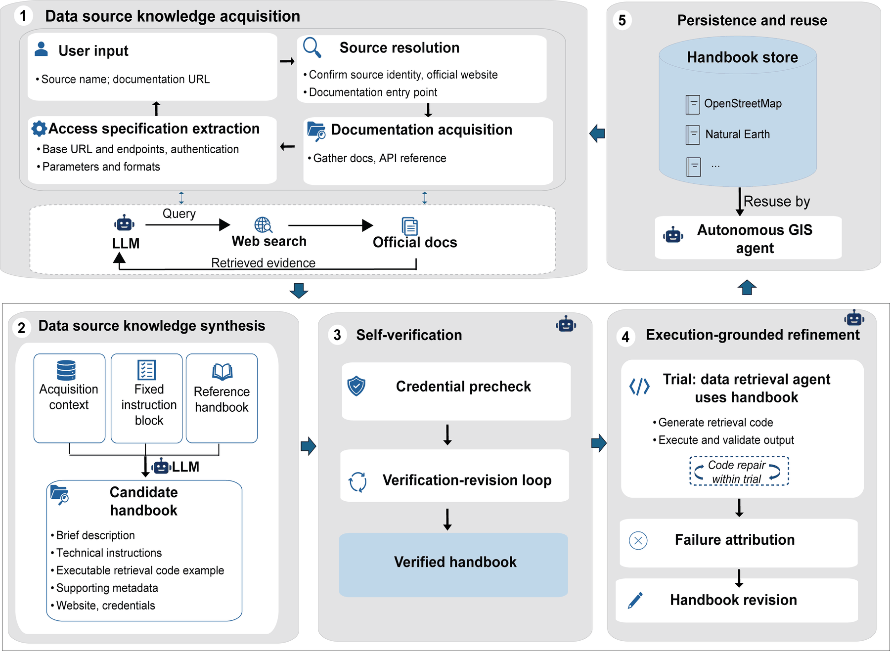
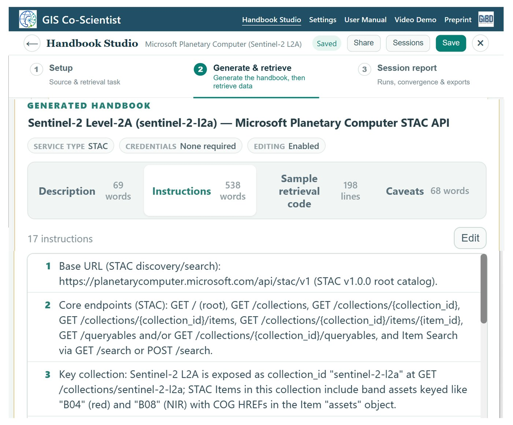
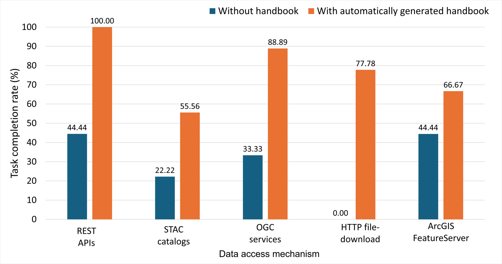
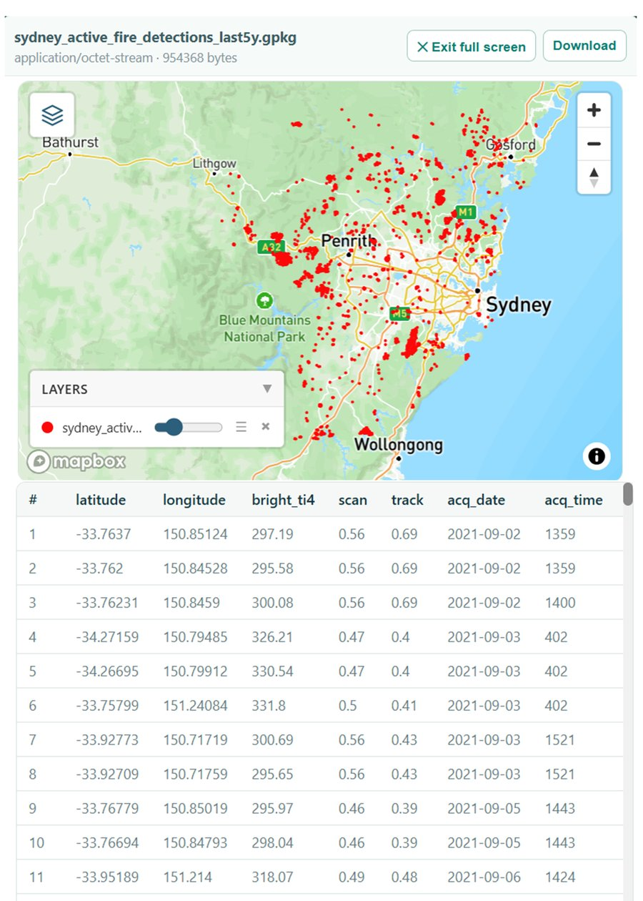
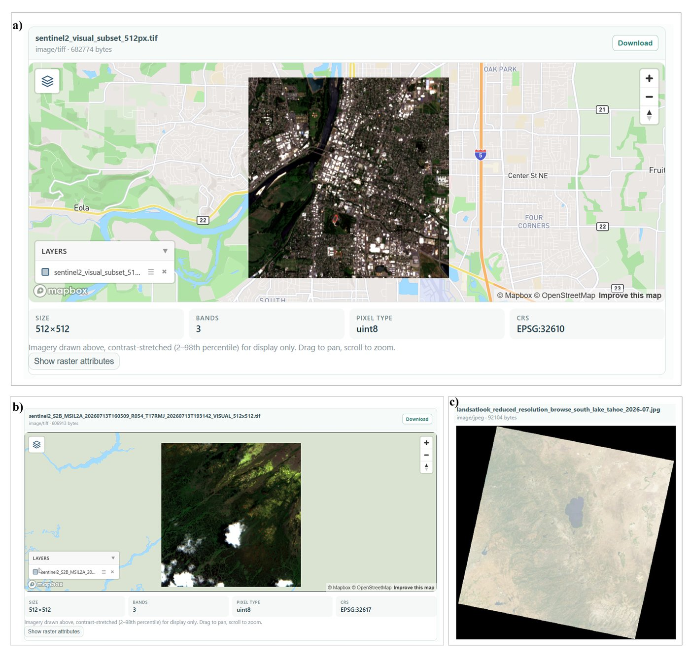
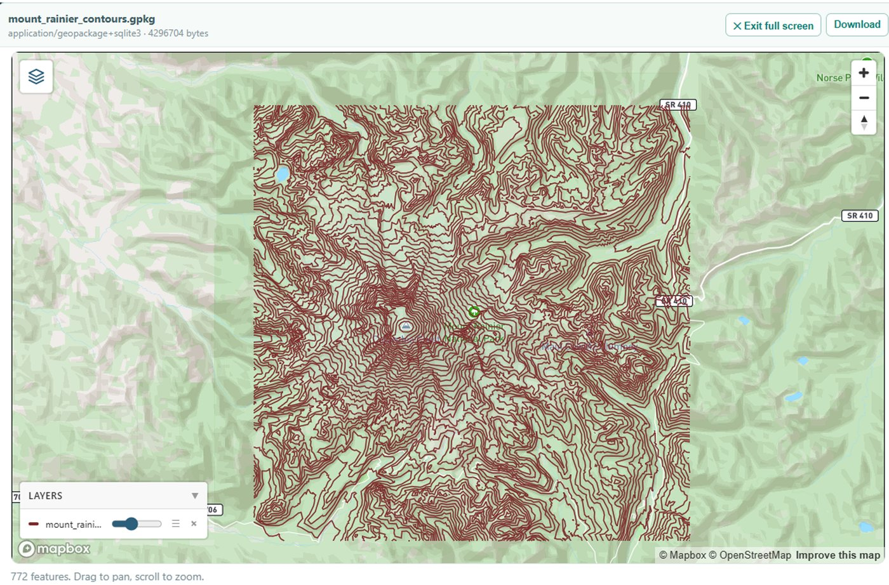
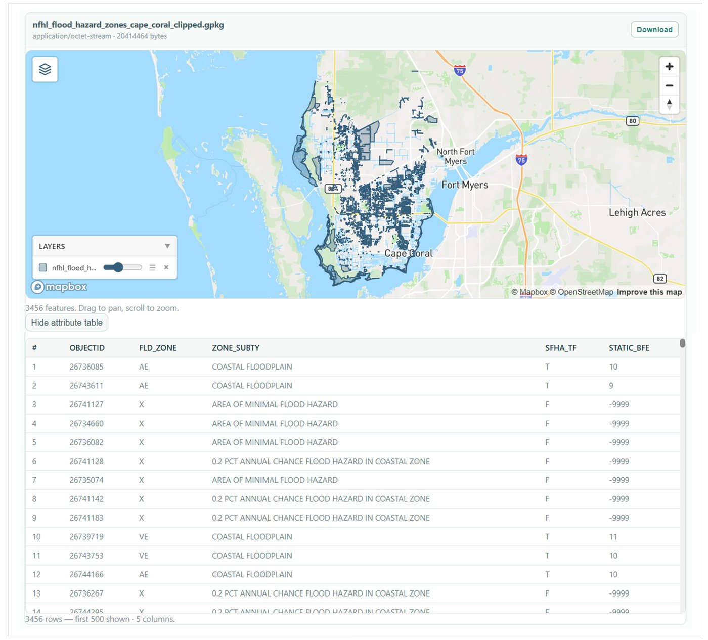
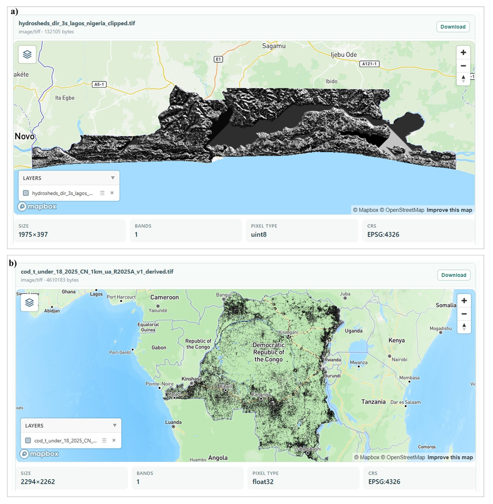
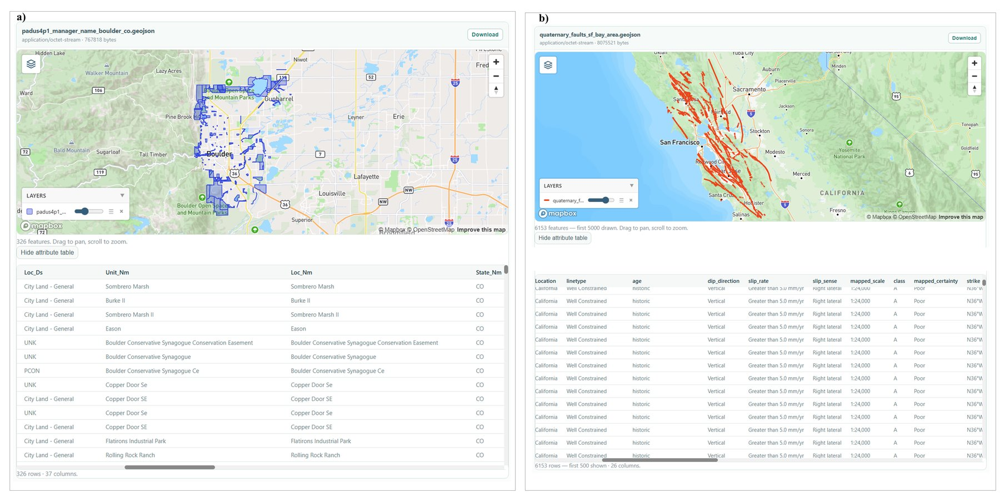

<div align="center">

### Geospatial Data Source Onboarding

**Toward self-growing data retrieval in autonomous GIS: an LLM-based framework for onboarding new geospatial data sources.**

<br>


<br><br>

<a href="https://www.gis-coscientist.online/handbook-studio"></a>

<br><br>

[**Overview**](#overview) ·
[**Framework**](#framework) ·
[**Implementation**](#implementation) ·
[**Results**](#results) ·
[**Setup**](#setup) ·
[**Citation**](#citation)

</div>

##  Overview

GIS agents can only retrieve data from sources someone has already integrated
for them. This framework lets an agent **onboard a new source by itself**.
From just a source name (and optionally a documentation URL), it builds a
**handbook** of source-specific operational knowledge, tests it against the
live service, and keeps it for reuse.

<table>
<tr>
<td align="center" width="25%"><strong>77.8%</strong><br><sub>Tasks completed with a generated handbook (vs 28.9% without)</sub></td>
<td align="center" width="25%"><strong>13 / 15</strong><br><sub>LLM-Find benchmark tasks completed</sub></td>
<td align="center" width="25%"><strong>5 / 5</strong><br><sub>End-to-end analyses that got their data</sub></td>
<td align="center" width="25%"><strong>~2.9 min</strong><br><sub>To generate a handbook (~77k tokens)</sub></td>
</tr>
</table>

---

##  Framework



| Layer | What it does |
|---|---|
|  **1. Knowledge acquisition** | Resolves the source, gathers its documentation, and extracts endpoints, parameters, formats and credentials |
|  **2. Knowledge synthesis** | Writes a structured handbook: instructions plus an executable retrieval example |
|  **3. Self-verification** | Asks the user for any keys, runs the example against the live service, and revises it until it works |
|  **4. Execution-grounded refinement** | Uses the handbook on a real task, attributes each failure, and revises the handbook only when the handbook is at fault |
|  **5. Persistence and reuse** | Stores verified handbooks in a library the agent draws on for later tasks |

> [!NOTE]
> A revised handbook replaces the stored one only after it has successfully delivered data, so a bad revision can never displace a working handbook.

---

##  Implementation

**Handbook Studio** is the web interface for running onboarding:
**Setup** → **Generate & retrieve** → **Session report**.



<details>
<summary><strong>Implementation details</strong></summary>

<br>

| Stage | Details |
|---|---|
| Acquisition | GPT-5.2 with web search; documentation is fetched and converted to text (8,000 characters per document, 14,000 in total) |
| Synthesis | Acquired context + fixed authoring instructions + a reference handbook → a nine-field handbook |
| Verification | Runs the code example on a small sample; stops on success, after 6 attempts, or after 3 identical failures |
| Credentials | Execution pauses so the user can supply keys, which are passed as environment variables |
| Sessions | Saved as JSON: handbook versions, code attempts, diagnostics, request traces, outputs and token use |

**Handbook fields:** `data_source_name` · `brief_description` · `runbook` ·
`code_example` · `website` · `requires_key` · `key_name` · `caveats` ·
`key_signup_url`

</details>

---

##  Results

### 1. Generated handbooks vs. no handbook

45 retrieval tasks: 15 sources, 3 per access mechanism, each task run with and without a generated handbook.

| Condition | Verified complete | Partial output | No usable output |
|---|:---:|:---:|:---:|
| Without handbook | 28.9% | 22.2% | 48.9% |
| **With generated handbook** | **77.8%** | 17.8% | **4.4%** |



<details>
<summary><strong>Sources evaluated</strong></summary>

<br>

| Mechanism | Sources |
|---|---|
| REST API | NASA FIRMS · OpenStreetMap Overpass · CDC PLACES |
| STAC | Microsoft Planetary Computer · Element 84 Earth Search · USGS Landsat |
| OGC | FEMA NFHL (WFS) · USGS 3DEP (WCS) · OGC API–Features |
| HTTPS download | WorldPop · Natural Earth · HydroSHEDS |
| ArcGIS FeatureServer | USGS Quaternary Faults · USGS PAD-US · NOAA CUSP |

</details>

### Sample retrievals

<table>
<tr>
<td width="40%" valign="top"><br><sub><b>REST</b> · 3,166 NASA FIRMS fire detections, Sydney</sub></td>
<td width="60%" valign="top"><br><sub><b>STAC</b> · Sentinel-2 (Earth Search, Planetary Computer) and Landsat scenes</sub></td>
</tr>
<tr>
<td width="50%" valign="top"><br><sub><b>OGC WCS</b> · 772 contours from USGS 3DEP, Mount Rainier</sub></td>
<td width="50%" valign="top"><br><sub><b>OGC WFS</b> · 3,456 FEMA flood-zone polygons, Cape Coral</sub></td>
</tr>
<tr>
<td width="45%" valign="top"><br><sub><b>HTTPS</b> · HydroSHEDS, Lagos (wrong product: partial) · WorldPop, DR Congo</sub></td>
<td width="55%" valign="top"><br><sub><b>ArcGIS</b> · 326 PAD-US areas, Boulder · 6,153 Quaternary faults</sub></td>
</tr>
</table>

### 2. LLM-Find benchmark

The 15 tasks from [LLM-Find](https://doi.org/10.1080/17538947.2025.2458688) (Ning et al., 2025), rerun with **generated** instead of hand-written handbooks.

| Source | Tokens | Time | Completed | Adaptation |
|---|--:|--:|:--:|---|
| OpenStreetMap | 56,716 | 259 s | 2/2 | 1 refinement |
| Esri World Imagery | 100,724 | 217 s | 4/4 | — |
| Census TIGER/Line | 61,463 | 159 s | 2/2 | — |
| Census ACS API | 136,881 | 176 s | 2/2 | 1 refinement |
| OpenTopography | 67,146 | 134 s | 2/2 | 1 external retry |
| OpenWeather | 60,782 | 142 s | 0/2 | Wrong access route |
| NYT COVID-19 | 56,758 | 116 s | 1/1 | — |

### 3. End-to-end autonomous GIS

Onboarding built into a full analysis workflow: the agent reuses or generates handbooks, retrieves the data, then runs the analysis.

| Task | Data | Analysis |
|---|:---:|:---:|
| LA active fires by census tract | ✅ | ✅ |
| California earthquake activity by county | ✅ | ✅ |
| Philadelphia hospital accessibility | ✅ re-onboarded | ❌ wrong CRS |
| South Carolina obesity & population density | ✅ after rerun | ✅ |
| LA earthquake kernel density | ✅ | ❌ output not saved |

> [!TIP]
> Data were acquired for all five tasks. Both failures happened in the downstream analysis, not in retrieval.

---

##  Setup

```bash
git clone https://github.com/AutonomousGIS-AGSI/Geospatial-Data-Source-Onboarding.git
cd Geospatial-Data-Source-Onboarding
pip install -r requirements.txt
cp .env.example .env        # optional
python WebUI/app.py         # http://localhost:4041
```

Enter an OpenAI (or GIBD) API key under **Settings**. An Anthropic key is only needed for the Claude Agent SDK provider.

---

##  Citation

```text
Akinboyewa, T., & Li, Z. Toward Self-Growing Data Retrieval in Autonomous GIS:
An LLM-Based Framework for Geospatial Data Source Onboarding. Manuscript in preparation.
```

<div align="center">

<br>

`Acquire` · `Synthesize` · `Verify` · `Refine` · `Reuse`

<br><br>

<a href="#overview">Back to top ↑</a>

</div>
